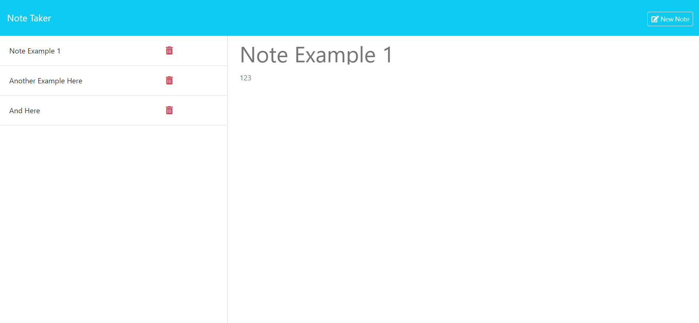

# Note Taker

## Description
This application is designed to make note taking easy. Notes can be written, saved and deleted. The user can select "Get Started" to start taking notes, entering both a title and description.

## Table of Contents
* [Installation](#installation)
* [Usage](#usage)
* [License](#license)
* [Contributing](#contributing)
* [Tests](#tests)
* [Credits](#credits)
* [Questions](#questions)

## Installation
npm i to install express and uuid

## Usage
To use this application, navigate to the link below. This will take the user to a landing page where they will then click "Get Started." From here the user can enter a title and description for their note. There will be two buttons in the upper-right-hand corner, "Save Note" and "Clear Note." The user can clear their entered notes by selecting "Clear Note." If the user chooses to save the note, they will select "Save Note." This will allow the note to appear in the left-side column. The user can revist their typed notes by selecting the item on the left. They can also delete their notes by clicking on the red trash icon on the note.
Click [here](https://note-taker-1-y2lx.onrender.com) for the deployed application.

## License
This project is licensed under the MIT license. Please feel free to read the license in full detail [here](https://opensource.org/license/mit)

## Contributing
Please contact me with contributions to the repo.

## Tests
N/A

## Credits
N/A

## Questions
Please contact me with any questions.

Github: hannahpsmith (https://github.com/hannahpsmith)

Email: hannahpsmith94@gmail.com
